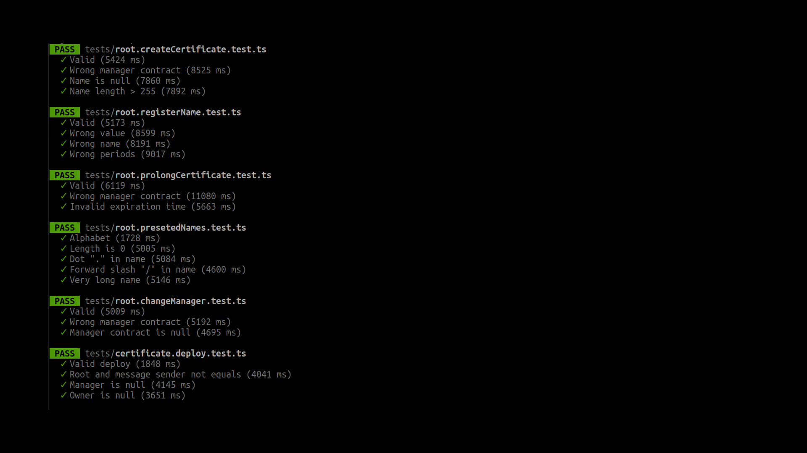

# Tests


## Installation
* Up local node from [INSTALLATION](INSTALLATION.md) instruction.
* Set up `deploy.local.timeout` and `deploy.local.url` in "config.template.ts".
  * A value that is too small will crash tests.
  * Large value increases execution time

## Run
```sh
yarn test
```

## Notes
### The tests are run sequentially
When running in parallel, the local node may give errors. Therefore, the execution time is long.

### Contract.ts
All classes for interacting with contracts extend Contract.ts. The basic concept is one instance of a class - one contract in net.

### Parameters of Root.sol
Some Root parameters are not hardcoded. These parameters are passed to the constructor so that the class can be tested.

### Result example


